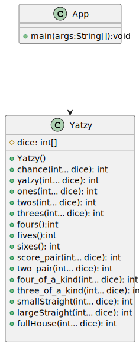

# Yatzy ejercicio de refactorización

El código proporcionado implementa un conjunto de funciones relacionadas con el juego de dados Yatzy. Aquí se explica cada función:

## Clase Yatzy
La clase Yatzy tiene un constructor que inicializa el array dice con los valores de los dados.




```java
public class Yatzy {

    protected int[] dice;

    public Yatzy(int... dice) {
        this.dice = new int[5];
        for (int die = 0; die < dice.length; die++) {
            this.dice[die] = dice[die];
        }
    }
}
```
### Métodos de la clase Yatzy

**chance(int... dice)**
Calcula la puntuación total sumando todos los valores de los dados.

```java
public static int chance(int... dice) {
    int total = 0;
    for (int die : dice) {
        total += die;
    }
    return total;
}
```
**yatzy(int... dice)**
Verifica si hay un "yatzy" en la tirada, es decir, si todos los dados tienen el mismo valor. Devuelve 50 si es cierto, de lo contrario, 0.

```java
public static int yatzy(int... dice) {
    int[] counts = new int[6];
    for (int die : dice)
        counts[die-1]++;
    for (int i = 0; i != 6; i++)
        if (counts[i] == 5)
            return 50;
    return 0;
}
```
**ones(int... dice)**
Suma los valores de los dados que muestran el número 1.

```java
public static int ones(int... dice) {
    int sum = 0;
    for (int die : dice) {
        if (die == 1) {
            sum += die;
        }
    }
    return sum;
}
```
**twos(int... dice)**
Suma los valores de los dados que muestran el número 2.

```java
public static int twos(int... dice) {
    int sum = 0;
    for (int die : dice) {
        if (die == 2) {
            sum += die;
        }
    }
    return sum;
}
```
**threes(int...dice)**
Suma los valores de los dados que muestran el número 3.

```java
public static int threes(int... dice) {
    int sum = 0;
    for (int die : dice) {
        sum += die == 3 ? 3 : 0;
    }
    return sum;
}
```
**fours()**
Suma los valores de los dados que muestran el número 4.

```java
public int fours() {
    int sum = 0;
    for (int die : dice) {
        sum += die == 4 ? 4 : 0;
    }
    return sum;
}
```

**fives()**
Suma los valores de los dados que muestran el número 5.

```java
public int fives() {
    int sum = 0;
    for (int die : dice) {
        sum += die == 5 ? 5 : 0;
    }
    return sum;
}
```
**sixes()**
Suma los valores de los dados que muestran el número 6.

```java
public int sixes() {
    int sum = 0;
    for (int die : dice)
        sum += die == 6 ? 6 : 0;
    return sum;
}
```
**score_pair(int... dice)**
Busca un par en la tirada y devuelve la puntuación del par encontrado, multiplicado por 2.

**two_pair(int... dice)**
Busca dos pares en la tirada y devuelve la puntuación de los dos pares encontrados, multiplicada por 2. Si no hay dos pares, devuelve 0.

**four_of_a_kind(int... dice)**
Busca cuatro dados iguales en la tirada y devuelve la puntuación de esos cuatro dados, multiplicada por 4. Si no hay cuatro dados iguales, devuelve 0.

**three_of_a_kind(int... dice)**
Busca tres dados iguales en la tirada y devuelve la puntuación de esos tres dados, multiplicada por 3. Si no hay tres dados iguales, devuelve 0.

**smallStraight(int... dice)**
Verifica si la tirada representa una escalera pequeña (1, 2, 3, 4, 5). Devuelve 15 si es cierto, de lo contrario, 0.

**largeStraight(int... dice)**
Verifica si la tirada representa una escalera grande (2, 3, 4, 5, 6). Devuelve 20 si es cierto, de lo contrario, 0.

**fullHouse(int... dice)**
Verifica si la tirada representa una "full house" (un par y un trío). Devuelve la puntuación total si es cierto, de lo contrario, 0.


